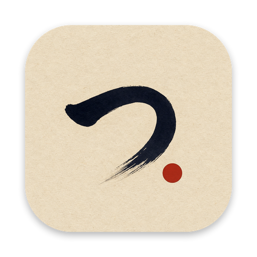
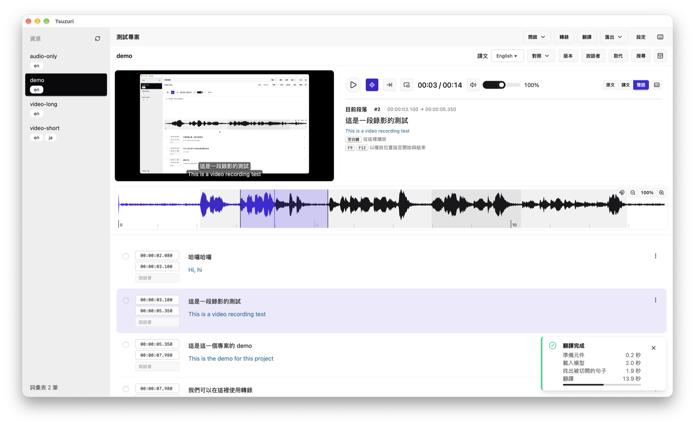

<p align="center">
  
</p>

<h1 align="center">Tsuzuri</h1>

<p align="center">
  Transcribe video and audio into subtitles, translate them, and proofread the result — all on your own computer.
</p>

<p align="center">
  <a href="https://github.com/elct9620/tsuzuri/releases/latest"></a>
  <a href="https://github.com/elct9620/tsuzuri/actions/workflows/ci.yml"></a>
  <a href="LICENSE"></a>
</p>

<p align="center">
  <a href="README.zh-TW.md">繁體中文</a> ·
  <a href="https://github.com/elct9620/tsuzuri/releases/latest">Download</a> ·
  <a href="https://portaly.cc/aotoki/product/lV2gJTEFE090h6x1zXhj">Sponsor</a>
</p>



## Features

Audio and text never leave the machine, and the transcription and translation engines come with the app.

| Feature | What it does |
|---|---|
| Transcription | whisper.cpp, with optional VAD |
| Translation | llama.cpp, guided by a glossary |
| Proofreading | Waveform, comparison, versions |
| Speakers | Told apart or named, carried into exports |
| Export | SRT or plain text, bilingual too |

## Installation

Download the installer for your platform from [Releases](https://github.com/elct9620/tsuzuri/releases).

| Platform | Download | Bundled whisper.cpp and llama.cpp |
|---|---|---|
| Windows x64 | NSIS installer (`*-setup.exe`) or MSI | Vulkan build |
| macOS (Apple Silicon) | `.dmg` | Metal build |
| Linux x64 | `.deb` or `.rpm` | Vulkan build |

The installer includes ffmpeg as well. Without a Vulkan-capable GPU driver, or to use another build such as CUDA, choose its executable in the app. Tsuzuri is not code-signed, so the system warns the first time it opens.

### Verifying downloads

Each release lists every file's checksum in `SHA256SUMS`. Run these in the download folder:

```bash
shasum -a 256 -c SHA256SUMS --ignore-missing   # macOS, Linux
Get-FileHash <file>                            # Windows PowerShell
```

On Windows, compare the checksum it prints with the file's line in `SHA256SUMS`.

### macOS

macOS blocks the first launch because the app is not notarized. After moving it to Applications, remove the quarantine flag once in Terminal:

```bash
xattr -dr com.apple.quarantine /Applications/Tsuzuri.app
```

### Windows

Two things can stop the first launch on Windows:

| When | Do |
|---|---|
| SmartScreen shows "Windows protected your PC" | Choose **More info**, then **Run anyway** |
| The app does not start | Install the [Microsoft Edge WebView2 Runtime](https://developer.microsoft.com/microsoft-edge/webview2/) (built into Windows 11) |

### Linux

The packages declare the libraries the bundled engines need, such as libgomp and libvulkan, so install them with the package manager to bring those along:

```bash
sudo apt install ./Tsuzuri_<version>_amd64.deb      # Debian, Ubuntu
sudo dnf install ./Tsuzuri-<version>-1.x86_64.rpm   # Fedora
```

### Updates

| When | What happens |
|---|---|
| Tsuzuri opens | Checks for a newer version |
| Any time | Settings → Version and updates → **Check for updates** |
| You choose **Update** | Downloads, verifies, installs, restarts |
| A task runs | Updating is refused |
| No check at launch | Turn it off in Version and updates |

At launch Tsuzuri checks tsuzuri.aotoki.me for a newer version on your update channel and offers **Update** in a notification. Updating downloads the same kind of installer you installed from and checks its signature. Only then does it stop the engines and install, and nothing is downloaded until you choose **Update**. On Linux, installing asks for your password as `apt` or `dnf` would.

#### Update channels

| Update channel | Receives |
|---|---|
| Stable (default) | Released versions |
| Preview | Every development build, and each release |

Choose the channel under Settings → Version and updates. A preview is labelled with the release it builds on and when it was built. Moving from Preview back to Stable waits for the next release, or choose **Roll back to stable now** to reinstall the current release straight away. The rpm package offers only Stable.

## Getting Started

```
  Open ▾ → a folder ─▶ pick a Resource ─▶ Transcribe ─▶ Translate ─▶ proofread ─▶ Export ▾
```

| Step | Where |
|---|---|
| Open a folder | **Open** → **Open a folder** |
| Pick a video | The Resource list |
| Transcribe | **Transcribe**, then **Transcribe** |
| Translate | **Translate**, pick a language |
| Proofread | Click a Segment to play it |
| Export | **Export** → a format |

A folder is a Project: each video or audio file and its subtitles sharing a name are one Resource. Models download on first use; see [Models](#models).

## Models

Choose models in Settings; a preset below downloads the first time it is used.

| Purpose | Format | Presets |
|---|---|---|
| Transcription | whisper.cpp GGML (`.bin`) | [Breeze-ASR-25](https://huggingface.co/tsuzuri-app/Breeze-ASR-25-ggml) (Chinese), [Whisper large-v3-turbo and large-v3](https://huggingface.co/ggerganov/whisper.cpp) |
| VAD, when turned on | whisper.cpp GGML (`.bin`) | [Silero v6.2.0](https://huggingface.co/ggml-org/whisper-vad) |
| Translation | GGUF | [Qwen3-4B-Instruct-2507](https://huggingface.co/unsloth/Qwen3-4B-Instruct-2507-GGUF) |
| Speaker diarization | GGUF | [Nemotron-3-Diarization](https://huggingface.co/nvidia/Nemotron-3-Diarization) |

### Model sources

| Source | How |
|---|---|
| A preset | Downloads into the Hugging Face cache |
| A file on disk | Any file in the slot's format |
| A Hugging Face repository | Any file it holds for the slot |
| A gated repository | Uses the `hf auth login` token |
| One project | Its own transcription and translation models |

The Hugging Face cache is shared with other Hugging Face tools, so a file already there is not downloaded again. A project's own models suit its language, such as a Japanese model for a Japanese project.

## Contributing

How to build, run and test Tsuzuri is in [CONTRIBUTING.md](CONTRIBUTING.md).

## Sponsor

| Where | Link |
|---|---|
| Portaly | [Sponsor Tsuzuri](https://portaly.cc/aotoki/product/lV2gJTEFE090h6x1zXhj) |
| In the app | Settings → About → **Sponsor** |

Tsuzuri is free and open source; sponsoring keeps its development going.

## License

Tsuzuri is licensed under the [Apache License 2.0](LICENSE). The licenses of the engines and everything else it ships are in the license notice under Settings → About.
